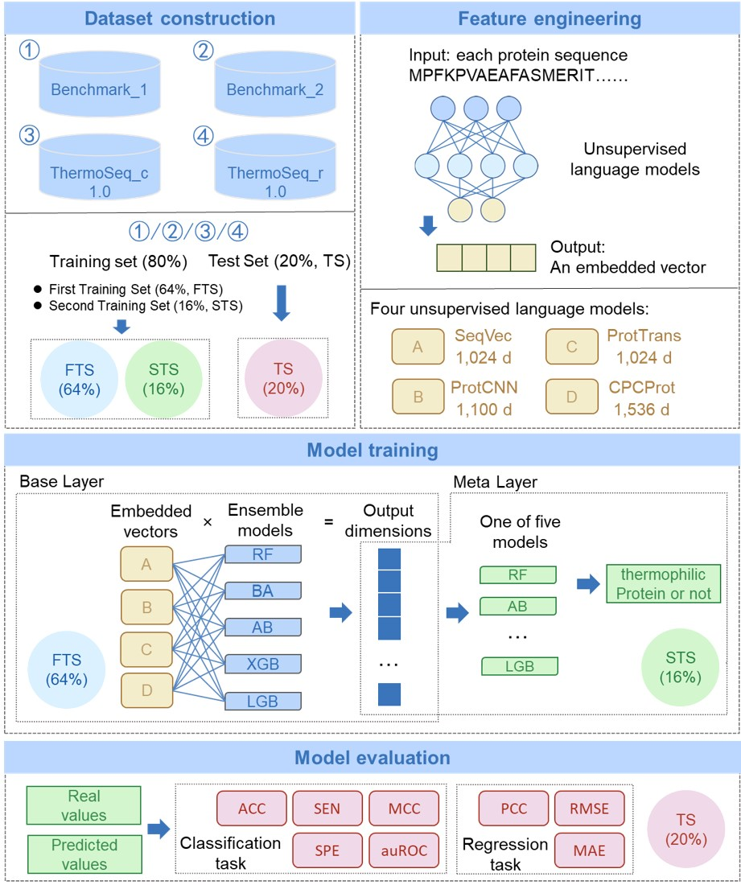

# ThermoFinder: A sequence-based thermophilic proteins prediction framework

<!-- Add buttons here -->


<!-- Describe your project in brief -->
**Feel free to contact me via email at yuhanid147@gmail.com if you encounter any issues or have any questions.**

**Introduction of ThermoFinder.**

Thermophilic proteins are important for academic research and industrial processes, and various computational methods have been developed to identify and screen them. However, their performance has been limited due to the lack of high-quality labeled data and efficient models for representing protein. Here, we proposed a novel sequence-based thermophilic proteins prediction framework, called ThermoFinder. The results demonstrated that ThermoFinder outperforms previous state-of-the-art tools on two benchmark datasets, and feature ablation experiments confirmed the effectiveness of our approach. Additionally, ThermoFinder exhibited exceptional performance and consistency across two newly constructed datasets, one of these was specifically constructed for the regression-based prediction of temperature optimum values directly derived from protein sequences. The feature importance analysis, using shapley additive explanations, further validated the advantages of ThermoFinder. We believe that ThermoFinder will be a valuable and comprehensive framework for predicting thermophilic proteins, and we have made our model open source and available on Github at https://github.com/Luo-SynBioLab/ThermoFinder.

## 1. Introduction
These files contain source code for ThermoFinder. And established datasets in this article are also provided in [huggingface](https://huggingface.co/datasets/HanselYu/ThermoSeqNet).
ThermoFinder is a python implementation of the model.

**Here is the framework of ThermoFinder.**

<p align="center">
  
</p>

# 2. Prerequisites
[(Back to top)](#table-of-contents)

Notice:
- You need download four pretrained language modoels: *SeqVec*, *ProtCNN*, *ProtTrans*, *CPCProt*, the link is provided as follows:
- https://github.com/Rostlab/SeqVec
- https://github.com/google-research/google-research/tree/master/using_dl_to_annotate_protein_universe
- https://github.com/agemagician/ProtTrans?tab=readme-ov-file#models
- https://github.com/amyxlu/CPCProt

## 3. Installation
```
python = 3.8.13
```
You could configure enviroment by running this
```
pip install -r requirment.txt
```

## 4. Requirments
In order to run successfully, the generation of embedded vectors requires GPU. We utilized an NVIDIA GeForce RTX 3080 with 10018MiB to embed protein sequences to a vector.
Other hardware equipments are not necessary.

## 5. Usage
For ThermoFinder, you could run Fused_model_XX.py file,  model training and prediction are all implemented.

  -  Download required Python package
         
         pip install -r requirements.txt   

## 6. Footer
If you use this code or our models for your publication, please cite the original paper:

Yu, Han, and Xiaozhou Luo. "ThermoFinder: A sequence-based thermophilic proteins prediction framework." bioRxiv (2024): 2024-01. [https://www.biorxiv.org/content/10.1101/2024.01.02.573852v1]

